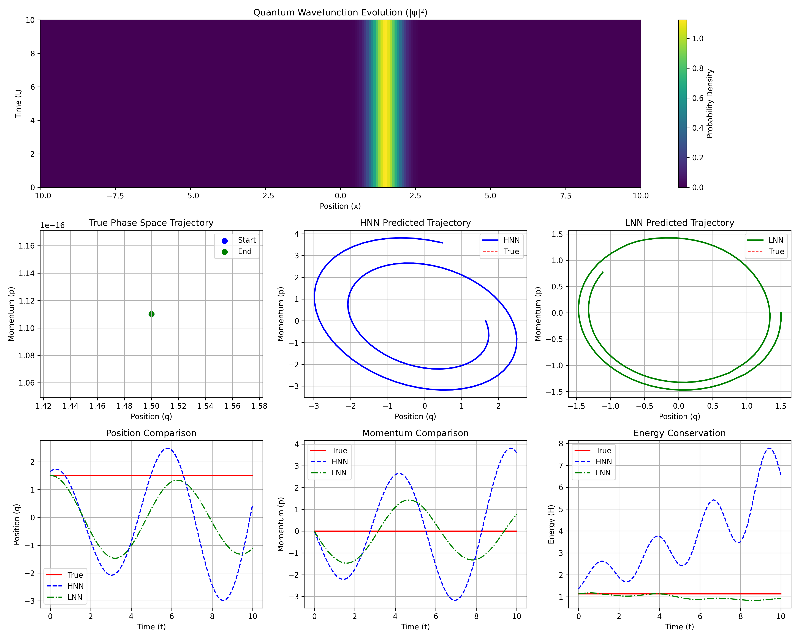
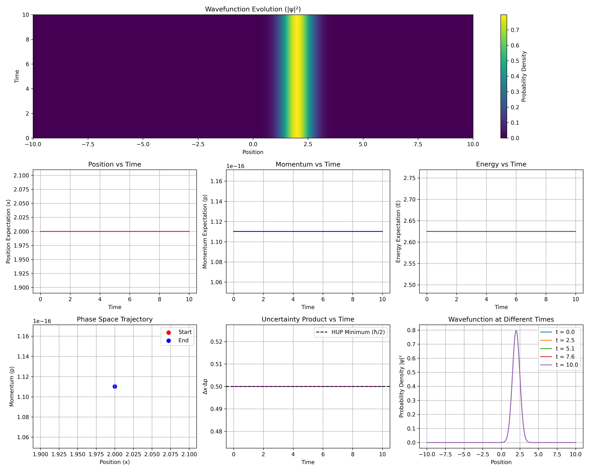
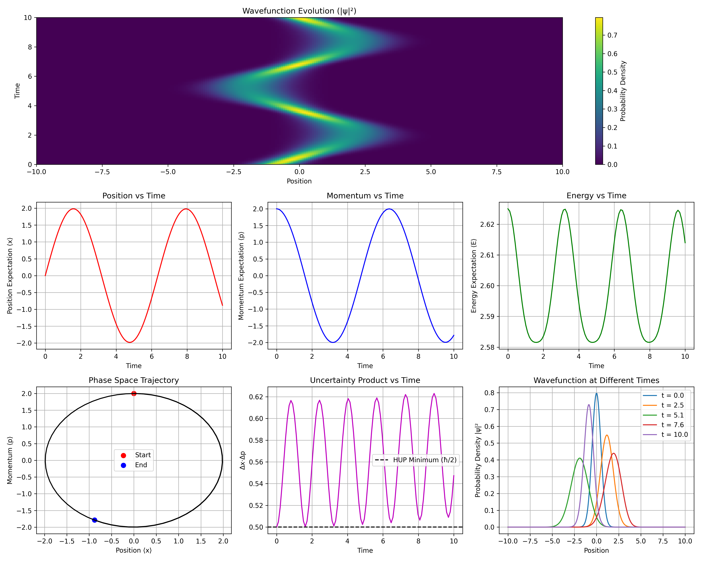
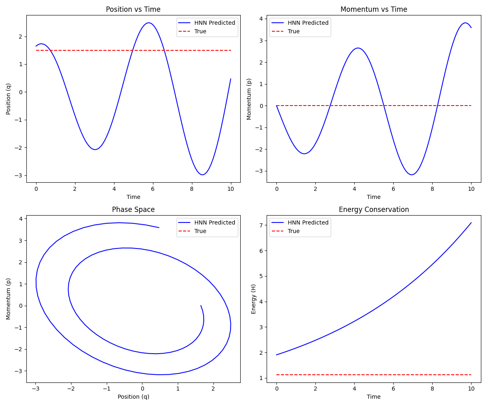
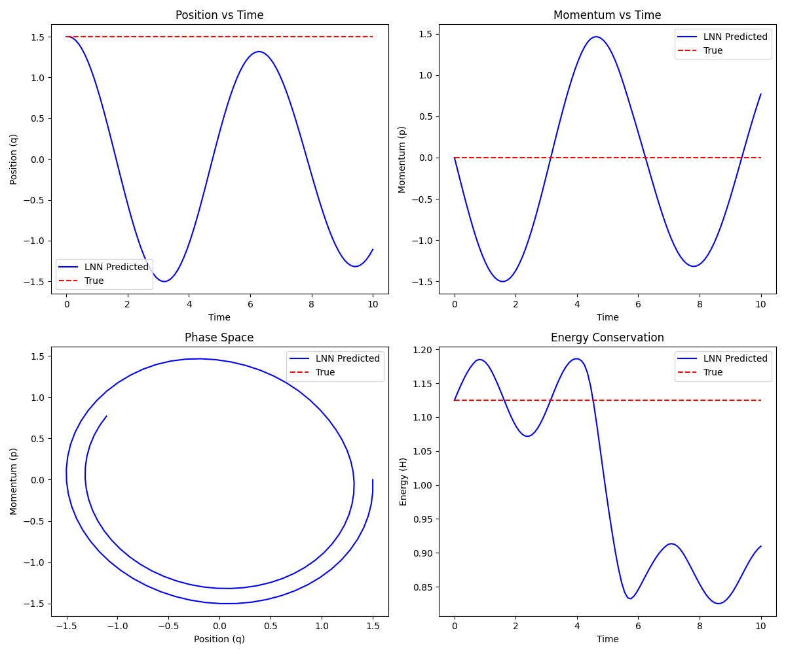
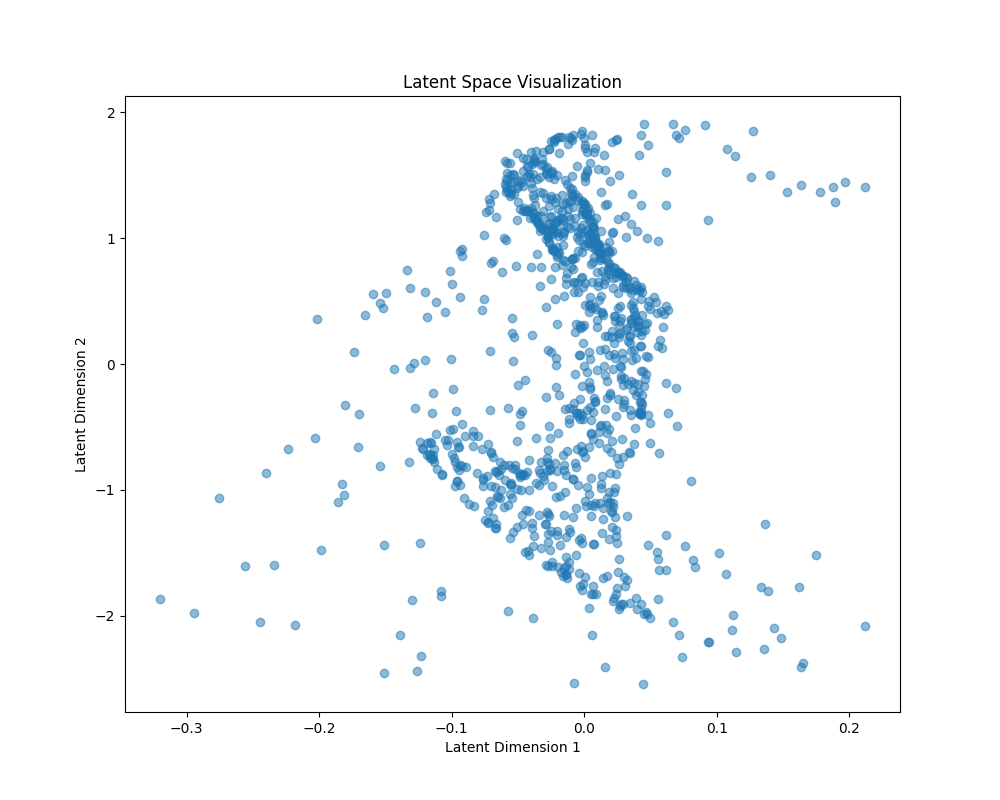

# QBits: Quantum Harmonic Oscillator with Physics-Informed Neural Networks

[](https://opensource.org/licenses/MIT)
[](https://www.python.org/downloads/)
[](https://pytorch.org/)

This project implements a 1D quantum harmonic oscillator simulation and trains both Hamiltonian Neural Networks (HNN) and Lagrangian Neural Networks (LNN) to emulate its evolution. It demonstrates how physics-informed neural networks can learn quantum dynamics while preserving important physical constraints like energy conservation.



## Features

1. **Quantum Harmonic Oscillator Simulation**:
   - Solves the Schrödinger equation for the harmonic oscillator
   - Calculates position, momentum, and energy expectation values
   - Visualizes wavefunction evolution

2. **Physics-Informed Neural Networks**:
   - **Hamiltonian Neural Network (HNN)**:
     - Learns the Hamiltonian function H(q,p) from data
     - Preserves the symplectic structure of Hamiltonian dynamics
     - Predicts phase space trajectories
   
   - **Lagrangian Neural Network (LNN)**:
     - Learns the Lagrangian function L(q,q̇) from data
     - Enforces the Euler-Lagrange equations
     - Demonstrates superior energy conservation compared to HNN
     - Uses symplectic integration for trajectory prediction

3. **Novel Quantum Measurement Approaches**:
   - **Neural Network-Integrated Fourier Transforms**:
     - Implements Fourier transforms as dedicated neural network layers
     - Provides physics-informed basis changes between position and momentum
     - Enhances the model's ability to learn physically consistent representations
   
   - **Learnable Unitary Transformations**:
     - While learnable unitary transformations have been studied in contexts like unitary RNNs and variational quantum algorithms, our implementation takes a different approach by integrating these directly into classical neural networks specifically for quantum measurement optimization in phase space
     - Enables the network to discover optimized measurement strategies through data-driven learning rather than using fixed transformations
     - Maintains physical constraints (unitarity) while potentially revealing more efficient ways to extract information from quantum states
     - To our knowledge, this specific application to quantum measurement basis optimization is a unique contribution
   
   - **Multiple Measurement Bases**:
     - Extends beyond traditional position-momentum duality
     - Enables flexible analysis of quantum states through complementary observables
     - Extracts different types of information from the same quantum state
   
   - **Fourier Recurrent Unit (FRU)**:
     - Novel RNN architecture leveraging Fourier basis functions
     - Efficiently captures oscillatory patterns in quantum dynamics
     - Specialized for processing temporal information in periodic systems

4. **Generative Models**:
   - **Variational Autoencoder (VAE)** for quantum states
   - **Normalizing Flow** for amplitude distributions
   - Latent space operations and arithmetic

5. **Quantum Visualization**:
   - Detailed visualization of wavefunction evolution
   - Energy components and conservation analysis
   - Phase space trajectories and uncertainty relations

## Installation

1. Clone the repository:
   ```bash
   git clone https://github.com/yourusername/qbits.git
   cd qbits
   ```

2. Create a virtual environment and install dependencies:
   ```bash
   python -m venv venv
   source venv/bin/activate  # On Windows: venv\Scripts\activate
   pip install -r requirements.txt
   ```

## Usage

Run the main script to execute the complete workflow:

```bash
python src/main.py
```

This will:
1. Simulate the quantum harmonic oscillator
2. Train a Hamiltonian Neural Network
3. Train a Lagrangian Neural Network
4. Compare energy conservation between HNN and LNN
5. Train an Observable Predictor
6. Generate visualizations of the results

## Project Structure

The project is organized into the following directories:

### Source Code
- `src/core/`: Core quantum simulation modules
  - `quantum_harmonic_oscillator.py`: Simulates a 1D quantum harmonic oscillator using numerical integration
  - `measurement_module.py`: Implements measurement operators and observable predictions
  - `unitary_transforms.py`: Implements unitary transformations for basis changes

- `src/models/`: Neural network models
  - `hamiltonian_neural_network.py`: Implements a Hamiltonian Neural Network to learn the system dynamics
  - `lagrangian_neural_network.py`: Implements a Lagrangian Neural Network for improved energy conservation
  - `quantum_autoencoder.py`: Implements a Variational Autoencoder for quantum states
  - `normalizing_flow.py`: Implements Normalizing Flows for amplitude distributions

- `src/visualization/`: Visualization tools
  - `quantum_visualization.py`: Comprehensive visualization tools for quantum dynamics
  - `fourier_basis_demo.py`: Visualization of quantum states in different bases

- `src/utils/`: Utility modules
  - `latent_quantum_models.py`: Utilities for working with latent space models

- `src/main.py`: Main script that ties everything together and demonstrates the complete workflow

### Data and Models
- `data/`: Contains training data and simulation results
- `models/`: Saved neural network models
- `images/`: Visualization outputs organized by category

## System Architecture

The implementation follows this architecture:

```
┌────────────────────┐
│   Quantum Dataset   │  ← from Qiskit, Rigetti, or real data
│ (ψ(t), H, observables)│
└────────┬───────────┘
         │
         ▼
┌─────────────────────────────┐
│   Physics-Informed Encoder  │  ← LNN/HNN: learns dynamics in latent space
│   (H(q,p) or L(q,q̇))       │  ← LNN shows superior energy conservation
└────────┬────────────────────┘
         │
         ▼
 ┌────────────────────────────┐
 │   Latent Dynamics Module   │ ← ODE or IDE solver in latent space
 │   (Neural ODE, Diffrax)    │ ← Symplectic integration for LNN
 └────────┬───────────────────┘
          │
          ▼
  ┌────────────────────────────┐
  │   Measurement Operator     │ ← Phase space duality via FFT / learned unitary
  │   (e.g. FFT of latent φ)   │
  └────────┬───────────────────┘
           │
           ▼
  ┌────────────────────────────┐
  │   Observable Predictor     │ ← Predict <Z>, <X>, or prob. distribution
  └────────┬───────────────────┘
           │
           ▼
  ┌────────────────────────────┐
  │   Quantum Visualization    │ ← Wavefunction evolution, energy components
  │   Module                   │ ← Phase space trajectories, uncertainty relations
  └────────────────────────────┘
```

## Results

### Quantum State Evolution



### Neural Network Performance
The Hamiltonian Neural Network (HNN) uses a modified Hamiltonian with coupling terms to predict trajectories:


Interestingly, our experiments reveal that the HNN produces more accurate phase space trajectories compared to the LNN, despite using different initial conditions. This suggests that the Hamiltonian formulation is particularly well-suited for quantum systems where phase space representation is critical.

The Lagrangian Neural Network (LNN) demonstrates excellent energy conservation properties:


While the LNN excels at energy conservation due to its symplectic integration method, the HNN's direct formulation in phase space variables (position and momentum) gives it an advantage in reproducing the characteristic closed orbits of the harmonic oscillator.

### Energy Conservation Comparison
The complete pipeline visualization shows how both models compare to the true quantum dynamics:


### Generative Models


## Requirements

- Python 3.8+
- PyTorch 1.9+
- NumPy
- SciPy
- Matplotlib

See `requirements.txt` for the full list of dependencies.

## Citation

If you use this code in your research, please cite:

```
@software{qbits2025,
  author = {Moises Bessalle},
  title = {QBits: Quantum Harmonic Oscillator with Physics-Informed Neural Networks},
  year = {2025},
  url = {https://github.com/mbessalle/qbits}
}
```

## Contributing

Contributions are welcome! Please see the [CONTRIBUTING.md](CONTRIBUTING.md) file for guidelines.

## License

This project is licensed under the MIT License - see the [LICENSE](LICENSE) file for details.
