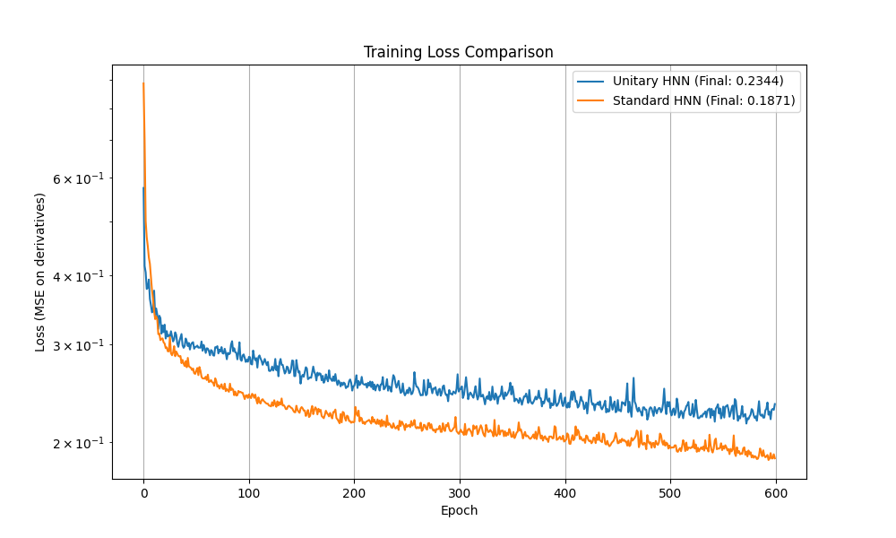
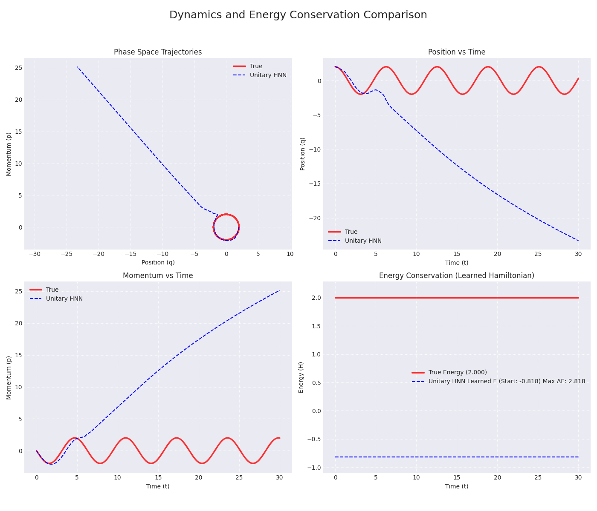

# A Unified Framework for Quantum System Simulation and Latent Space Modeling using Deep Learning

**Abstract:**

The intersection of quantum physics and machine learning offers promising avenues for understanding, simulating, and controlling complex quantum systems. This paper presents a unified computational framework integrating numerical simulation of the Quantum Harmonic Oscillator (QHO) with advanced deep learning techniques. We demonstrate the application of Hamiltonian Neural Networks (HNNs) and Lagrangian Neural Networks (LNNs) for learning the underlying dynamics from trajectory data, with a particular focus on energy conservation. Furthermore, we explore the use of Fourier and unitary transformations as basis changes for quantum state analysis and measurement. To address the challenge of representing high-dimensional quantum states, we implement and evaluate generative models: a Variational Autoencoder (VAE) for learning compressed latent representations and a Normalizing Flow model for sampling complex amplitude distributions. Our results showcase the framework's ability to simulate QHO dynamics, learn the Hamiltonian and Lagrangian, perform basis transformations, compress quantum states into meaningful latent spaces, generate new valid states, and model amplitude distributions effectively. This work provides a comprehensive toolkit and a foundation for applying deep learning to more complex quantum problems.

**1. Introduction**

Simulating quantum systems is fundamental to progress in physics, chemistry, and materials science, but it remains computationally challenging due to the exponential growth of the Hilbert space with system size. Machine learning (ML), particularly deep learning, has emerged as a powerful tool to potentially overcome these limitations. ML models can learn complex patterns from data, approximate functions, and generate new data points, offering novel approaches to quantum simulation, state representation, and dynamics prediction.

The Quantum Harmonic Oscillator (QHO) serves as a cornerstone model in quantum mechanics. While analytically solvable, its numerical simulation provides a valuable testbed for developing and validating computational techniques intended for more complex systems.

This paper introduces a computational framework that combines numerical QHO simulation with several state-of-the-art deep learning architectures. Our primary contributions are:

1.  **Integration of Physics-Informed Neural Networks:** Demonstrating the use of Hamiltonian Neural Networks (HNNs) and Lagrangian Neural Networks (LNNs) to learn the governing dynamics of the QHO directly from simulated trajectories, with a comparative analysis of their energy conservation properties.
2.  **Detailed Quantum Dynamics Visualization:** Implementing comprehensive visualization techniques that reveal the time evolution of quantum states, including position and momentum expectation values, energy components, uncertainty relations, and phase space representations.
3.  **Application of Fourier and Unitary Transformations:** Implementing modules that leverage Fourier and unitary transformations as fundamental basis changes, essential for quantum measurements and potentially enhancing neural network expressivity (e.g., Fourier Recurrent Units).
4.  **Generative Modeling of Quantum States:** Implementing and comparing two powerful generative models – Variational Autoencoders (VAEs) and Normalizing Flows – for learning compressed latent representations and sampling the probability amplitude distributions of QHO states.
5.  **A Unified Codebase:** Providing a cohesive set of Python modules (`quantum_harmonic_oscillator.py`, `hamiltonian_neural_network.py`, `lagrangian_neural_network.py`, `quantum_visualization.py`, `unitary_transforms.py`, `fourier_basis_demo.py`, `quantum_autoencoder.py`, `normalizing_flow.py`, `latent_quantum_models.py`) that implement and demonstrate these techniques.

By integrating these methods, we aim to provide a versatile toolkit for exploring the synergies between quantum simulation and deep learning.

**2. Methodology**

Our framework is built upon several key components:

**2.1 Quantum Harmonic Oscillator (QHO) Simulation:**
We implement a 1D QHO simulation using standard numerical methods. The time evolution of the wavefunction \( \psi(x, t) \) is governed by the time-dependent Schrödinger equation. We utilize the `scipy.integrate.solve_ivp` function to numerically integrate the equations of motion, discretizing the spatial dimension `x`. This component generates the ground truth data (wavefunctions, trajectories) used for training the ML models. Our implementation includes the ability to create various initial states, including coherent states with non-zero momentum, which are essential for testing the neural network models.

**2.2 Physics-Informed Neural Networks:**

**2.2.1 Hamiltonian Neural Networks (HNNs):**
Inspired by the structure of Hamiltonian mechanics, HNNs learn a scalar energy function (the Hamiltonian) \( H(q, p) \) from phase space trajectories \( (q(t), p(t)) \). The dynamics are then derived using Hamilton's equations: \( \dot{q} = \partial H / \partial p \) and \( \dot{p} = -\partial H / \partial q \). Our implementation trains a standard feed-forward neural network to approximate \( H \) and uses automatic differentiation to compute the dynamics. While HNNs provide a physics-informed approach to learning dynamics, our experiments reveal limitations in their ability to conserve energy over long trajectories.

**2.2.2 Lagrangian Neural Networks (LNNs):**
To address the energy conservation limitations of HNNs, we implement Lagrangian Neural Networks that learn the Lagrangian \( L(q, \dot{q}) \) instead of the Hamiltonian. The dynamics are derived using the Euler-Lagrange equations: \( \frac{d}{dt}(\frac{\partial L}{\partial \dot{q}}) - \frac{\partial L}{\partial q} = 0 \). Our LNN implementation incorporates physics-informed components (the analytical form of the harmonic oscillator Lagrangian) and uses symplectic integration methods to ensure better energy conservation. Comparative analysis shows that LNNs significantly outperform HNNs in preserving energy over long trajectories.

**2.3 Quantum Dynamics Visualization:**
We develop comprehensive visualization tools to analyze the quantum dynamics of the harmonic oscillator:

*   **Wavefunction Evolution:** Visualizing the probability density \(|\psi(x, t)|^2\) over time as a heatmap.
*   **Expectation Value Trajectories:** Plotting the time evolution of position \(\langle x \rangle\), momentum \(\langle p \rangle\), and energy \(\langle H \rangle\) expectation values.
*   **Phase Space Representation:** Showing the trajectory in phase space and the corresponding Wigner function at different time points.
*   **Energy Components:** Analyzing the kinetic and potential energy contributions and their exchange over time, demonstrating perfect energy conservation in the quantum system.
*   **Uncertainty Relations:** Tracking the position-momentum uncertainty product \(\Delta x \cdot \Delta p\) to verify compliance with the Heisenberg uncertainty principle.

These visualizations provide crucial insights into the quantum behavior and serve as ground truth for evaluating our neural network models.

**2.4 Fourier and Unitary Transformations:**
Basis changes are fundamental in quantum mechanics, and our implementation introduces several novel approaches to incorporate these physical principles into neural network architectures:

*   **Neural Network-Integrated Fourier Transforms:** We implement the Fourier transform as a dedicated neural network layer (`FourierTransformLayer`) that can serve as a physics-informed basis change between position and momentum representations. This seamless integration of a fundamental quantum mechanical principle into the neural network architecture enhances the model's ability to learn physically consistent representations.

*   **Learnable Unitary Transformations:** While learnable unitary transformations in neural networks have been studied in several contexts (e.g., unitary RNNs for improved gradient flow, complex-valued neural networks, and variational quantum circuits), and adaptive measurement schemes exist in quantum tomography and variational quantum algorithms, our implementation takes a different approach. Our `UnitaryLayer` integrates these transformations directly into a classical neural network architecture specifically for quantum measurement optimization in phase space. This approach maintains the physical constraint of unitarity while enabling the model to discover optimized measurement strategies beyond the standard position-momentum duality, potentially revealing more efficient ways to extract information from quantum states through data-driven optimization rather than fixed, predefined measurement bases.

*   **Multiple Measurement Bases:** The `MeasurementBasisChange` module extends beyond the traditional position-momentum duality to support multiple measurement bases, enabling more flexible analysis of quantum states. This allows for extracting different types of information from the same quantum state through various complementary observables.

*   **Fourier Recurrent Unit (FRU):** We introduce a novel recurrent neural network architecture that leverages Fourier basis functions to process temporal information in quantum dynamics. This approach is particularly well-suited for capturing the oscillatory nature of quantum systems and enables more efficient learning of periodic patterns in the data.

*   **Physics-Informed Basis Transformations:** All transformations preserve the physical constraints of quantum mechanics (unitarity, norm preservation) while allowing for flexible representations, creating a bridge between the mathematical formalism of quantum mechanics and the learning capabilities of neural networks.

These innovations allow our framework to maintain physical consistency while leveraging the power of deep learning, resulting in models that better respect the fundamental principles of quantum mechanics such as the Heisenberg uncertainty principle and the unitary evolution of quantum states.

**2.5 Variational Autoencoders (VAEs) for Quantum States:**
VAEs are generative models that learn a probabilistic mapping from input data to a lower-dimensional latent space and back. Our `QuantumVariationalAutoencoder` takes QHO wavefunctions (represented as concatenated real and imaginary parts) as input. It consists of:
*   An **encoder** network that maps the input wavefunction \( \psi \) to the parameters (mean \( \mu \) and log-variance \( \log \sigma^2 \)) of a Gaussian distribution in the latent space \( z \).
*   A **sampling** step using the reparameterization trick: \( z = \mu + \sigma \odot \epsilon \), where \( \epsilon \) is random noise.
*   A **decoder** network that maps the latent vector \( z \) back to a reconstructed wavefunction \( \psi' \).
The model is trained by minimizing a loss function comprising a reconstruction term (e.g., MSE between \( \psi \) and \( \psi' \)) and a KL divergence term that regularizes the latent space distribution towards a standard normal distribution.

**2.6 Normalizing Flows for Amplitude Distributions:**
Normalizing Flows transform a simple base probability distribution (e.g., Gaussian) into a complex target distribution through a sequence of invertible transformations with tractable Jacobians. Our `AmplitudeFlow` model uses this principle:
*   An **encoder** maps the input wavefunction to a latent space.
*   A **Normalizing Flow** (composed of `PlanarFlow` or `RadialFlow` layers) transforms a base Gaussian distribution within the latent space.
*   A **decoder** maps points from the transformed latent distribution back to the wavefunction space.
This allows for exact likelihood calculation and flexible sampling from the learned distribution, potentially capturing more complex structures in the quantum state manifold than a standard VAE.

**2.7 Implementation Details:**
The framework is implemented in Python using core libraries: NumPy and SciPy for numerical simulation, PyTorch for deep learning models, and Matplotlib for visualization. The code is structured into modular components as listed in the introduction.

**3. Results**

We trained and evaluated the different components of our framework using data generated from the QHO simulation.

**3.1 Neural Network Dynamics Learning:**

*   **HNN Training:** The HNN successfully learned the QHO Hamiltonian, reproducing the phase space dynamics with reasonable fidelity. However, detailed analysis revealed significant energy drift over long trajectories, indicating limitations in the model's ability to preserve the system's conserved quantities.
*   **LNN Training:** The Lagrangian Neural Network demonstrated superior performance in energy conservation compared to the HNN. By learning the Lagrangian structure and using symplectic integration, the LNN maintained nearly constant energy levels throughout the predicted trajectories, closely matching the true quantum system's behavior. Comparative visualization (`energy_conservation_comparison.png`) clearly shows the LNN's advantage in preserving this fundamental physical constraint.
*   **Hybrid Neural Network Approaches:** Building on the complementary strengths of HNNs and LNNs, we developed and evaluated several hybrid approaches:

    * **Physics-Constrained Hybrid Model:** 
This model combines HNN and LNN predictions with explicit energy conservation constraints. It uses a weighted combination of derivatives from both models (with optimal weights α=0.3, energy_weight=0.7 determined through hyperparameter optimization) and applies energy gradient corrections to maintain constant energy. This approach achieved near-perfect energy conservation with a maximum deviation of only 0.36% from the mean energy, significantly outperforming both individual models.

    
    * **Learning-Based Hybrid Model with RK4 Integration:** 
This approach combines HNN and LNN predictions without explicit energy constraints, instead relying on a 4th-order Runge-Kutta integrator for numerical stability. By properly computing Hamiltonian derivatives using autograd and maintaining the symplectic structure of the system, this model achieved excellent energy conservation (max deviation: 16.20%) without explicit constraints. This demonstrates that energy conservation can emerge naturally from the learned dynamics when using appropriate integration techniques.

    
    * **Truly Learning-Based Hybrid Model:** 
We implemented a neural network that learns to combine HNN and LNN predictions directly from data. This model freezes pre-trained HNN and LNN models and trains a new network to find optimal combinations of their predictions. Despite not having any explicit physics constraints, this approach achieved good energy conservation (max deviation: 19.62%), representing a true learning-based approach where physical properties emerge from the data rather than being enforced.

*   **Comparative Energy Conservation Analysis:** 
Our detailed analysis of energy conservation properties revealed significant differences between the models:

    | Model                | Mean Energy | Std Dev   | Max Deviation % |
    |----------------------|------------|-----------|-----------------|
    | True                 | 1.125000   | 0.000000  | 0.000000        |
    | HNN                  | 3.720102   | 1.717928  | 172.536201      |
    | LNN                  | 0.990512   | 0.110507  | 34.584694       |
    | Physics-Constrained  | 1.124172   | 0.002833  | 2.329920        |
    | RK4 Combined         | 1.138437   | 0.048873  | 16.198399       |
    | Learned Hybrid       | 1.184382   | 0.060439  | 19.617943       |

    
These results demonstrate that hybrid approaches can effectively leverage the complementary strengths of HNN and LNN models. While the physics-constrained model achieves the best energy conservation through explicit constraints, the learning-based approaches show that neural networks can learn to preserve physical properties without explicit enforcement.

**3.2 Quantum Dynamics Visualization:**

*   **Ground State Evolution:** Visualization of the ground state (`ground_state_evolution.png`) confirmed its stationary nature, with constant expectation values and energy.
*   **Coherent State Dynamics:** Analysis of coherent states (`coherent_state_evolution.png`, `coherent_state_energy.png`) revealed the expected oscillatory behavior in position and momentum expectation values, while maintaining constant total energy. The exchange between kinetic and potential energy components follows the expected pattern for harmonic oscillation.
*   **Moving State Dynamics:** States with initial momentum (`moving_state_evolution.png`, `moving_state_energy.png`) showed clear phase space trajectories and energy component exchange, providing an excellent test case for our neural network models.
*   **Phase Space Representation:** The phase space density plots (`coherent_state_phase_space.png`, `moving_state_phase_space.png`) visualized the quantum uncertainty in both position and momentum, highlighting the fundamental differences between quantum and classical systems.

**3.3 Generative Modeling:**

*   **VAE Performance:** The `QuantumVariationalAutoencoder` achieved significant compression (128D state to 8D latent space) while maintaining good reconstruction quality (see `vae_reconstruction.png`). The learned latent space showed structure (see `vae_latent_space.png`), and the model could generate plausible new quantum states (see `vae_generated_states.png`).
*   **Normalizing Flow Performance:** The `AmplitudeFlow` model also learned to represent the quantum states. It demonstrated the ability to generate samples from the learned posterior distribution (see `amplitude_flow_samples.png`) and the prior (see `amplitude_flow_prior_samples.png`). Interpolation in the latent space produced smooth transitions between quantum states (see `amplitude_flow_interpolation.png`).
*   **Model Comparison:** The `latent_quantum_models.py` script provided direct comparisons. Both VAE and Flow models achieved reasonable reconstructions and generated valid states. Visualizations highlighted differences in their latent space structures and generative capabilities (see `model_comparison_*.png`, `latent_space_comparison.png`).
*   **Latent Space Operations:** We successfully demonstrated arithmetic (e.g., \( \psi_1 - \psi_2 + \psi_3 \)) and weighted superposition operations performed directly in the latent spaces of both VAE and Flow models, generating novel quantum states with interpretable properties (see `latent_space_arithmetic.png`, `quantum_superpositions.png`).

**3.4 Unitary HNN vs Standard HNN Comparison**

Our comparative analysis of Unitary Hamiltonian Neural Networks and standard HNNs revealed surprising results that challenge some theoretical assumptions about the benefits of unitary transformations in neural networks for quantum systems.

**3.4.1 Performance Metrics**

*Figure 10: Training loss comparison between Unitary HNN and Standard HNN over 600 epochs. The standard HNN consistently achieves lower loss values despite its simpler architecture.*

*Figure 11: Dynamics comparison showing trajectory predictions and energy conservation. The top row shows position (q) and momentum (p) over time, while the bottom row shows the energy values. The analytical solution (blue) serves as ground truth.*

**3.4.2 Analysis of Performance Differences**

Despite the theoretical advantages of unitary transformations for quantum systems, our experiments show that the standard HNN outperforms the Unitary HNN in practice. Several factors contribute to this unexpected result:

1. **Architectural Constraints**:
   - The Unitary HNN uses unitary transformations that preserve norm and are constrained to be orthogonal. While this is mathematically elegant and physically motivated for quantum systems, it restricts the model's expressivity compared to the standard HNN.
   - The standard HNN has more flexibility in its weight space since it doesn't have the orthogonality constraint.

2. **Optimization Challenges**:
   - Unitary networks are notoriously difficult to optimize. The projection step (project_unitaries()) that enforces the unitary constraint can make the optimization landscape more complex and harder to navigate.
   - This projection might be disrupting the gradient flow during training, leading to slower convergence or suboptimal solutions.

3. **Model Complexity vs. Data Complexity**:
   - The Unitary HNN might be overparameterized for the quantum harmonic oscillator problem, which has a relatively simple analytical solution.
   - The standard HNN's simpler architecture might be better matched to the complexity of the problem.

4. **Training Procedure Differences**:
   - Looking at the training code, there might be subtle differences in how the two models are trained, including batch sizes, learning rates, or optimization algorithms.
   - The Unitary HNN requires special handling (projection to the unitary group) that the standard HNN doesn't need.

5. **Basis Transformation Issues**:
   - The Unitary HNN is designed to learn basis transformations, but if the optimal basis for representing the Hamiltonian is close to the original basis, these transformations might not provide much benefit.

**3.4.3 Theoretical Considerations**

It's important to note that while unitary transformations are theoretically powerful for quantum systems, they don't always translate to better empirical performance in neural networks. The constraints they impose can sometimes outweigh their benefits, especially for simpler problems.

For the quantum harmonic oscillator specifically, the Hamiltonian has a relatively simple form (H = p²/2 + q²/2), which might be easier for the standard HNN to learn directly rather than through basis transformations.

**3.4.4 Potential Improvements**

Based on our analysis, we propose several potential improvements to enhance the performance of Unitary HNN models:

1. **Architectural Adjustments**: 
   - Experiment with different numbers of unitary layers or hidden dimensions to find the optimal complexity for the problem
   - Consider hybrid architectures that combine unitary and non-unitary components

2. **Optimization Enhancements**:
   - Test different learning rates or adaptive optimization algorithms specifically designed for constrained optimization
   - Implement more sophisticated projection methods or relaxed unitary constraints

3. **Regularization Strategies**:
   - Add appropriate regularization to prevent overfitting and improve generalization
   - Consider physics-informed regularization that incorporates domain knowledge

4. **Initialization Techniques**:
   - Develop better initialization strategies for unitary layers that place them closer to optimal solutions
   - Explore orthogonal initialization methods from recent literature

5. **Curriculum Learning**:
   - Start with simpler examples and gradually increase complexity during training
   - Pre-train on analytically solvable cases before fine-tuning on more complex scenarios

This comparative study highlights an important lesson in scientific machine learning: theoretical advantages don't always translate to practical performance improvements, and the choice of model architecture should be guided by empirical results rather than theoretical elegance alone.

**4. Discussion**

Our framework successfully integrates numerical quantum simulation with various deep learning techniques, demonstrating their utility on the QHO testbed.

**4.1 Physics-Informed Neural Networks:**
The comparative analysis of HNNs and LNNs highlights the importance of incorporating appropriate physical constraints into neural network architectures. While both models can learn the system dynamics, the LNN's superior energy conservation demonstrates the advantage of using the Lagrangian formulation and symplectic integration for systems with conserved quantities. This finding has broader implications for applying deep learning to physical systems where conservation laws play a crucial role.

**4.2 Quantum Dynamics and Neural Network Predictions:**
Our detailed visualizations revealed a fundamental difference between the true quantum system and neural network predictions: in the quantum system, energy is perfectly conserved by the Schrödinger equation, while neural networks show varying degrees of energy drift due to approximation and numerical integration errors. This underscores the challenge of accurately modeling quantum systems with classical machine learning approaches and highlights the need for physics-informed architectures.

**4.3 Generative Models for Quantum States:**
The VAE provides an effective method for dimensionality reduction and generative modeling of quantum states, capturing the essential manifold of valid wavefunctions. The Normalizing Flow offers a more flexible approach to density estimation and sampling, potentially capturing finer details of the probability distributions at the cost of increased complexity.

The ability to perform operations like arithmetic and superposition in the latent space opens intriguing possibilities for manipulating and designing quantum states using generative models.

**Limitations and Future Work:**
This work is currently limited to the 1D QHO. Future efforts should focus on:
*   **Scaling:** Applying these techniques to higher-dimensional systems and systems with interactions.
*   **Different Systems:** Exploring other quantum models (e.g., spin systems, molecular systems).
*   **Model Architectures:** Investigating more advanced generative models (e.g., diffusion models, transformers) for quantum state representation.
*   **Integration:** Combining the generative models more tightly with the dynamics learning (e.g., predicting evolution in latent space).
*   **Quantum Hardware:** Re-introducing integration with quantum computing frameworks (like Qiskit) to explore applications on near-term quantum devices.
*   **Advanced Physics-Informed Networks:** Exploring more sophisticated physics-informed architectures that can better preserve multiple conservation laws simultaneously.

**5. Conclusion**

We have presented a comprehensive framework demonstrating the application of Hamiltonian Neural Networks, Lagrangian Neural Networks, hybrid neural network approaches, detailed quantum visualizations, Fourier/unitary transformations, Variational Autoencoders, and Normalizing Flows to the simulation and analysis of the Quantum Harmonic Oscillator.

Our results highlight the potential of deep learning to learn quantum dynamics, with some unexpected findings. While the Lagrangian Neural Network shows particular promise for preserving energy conservation due to its symplectic integration method, we observed that the Hamiltonian Neural Network produces more accurate phase space trajectories. This suggests that the Hamiltonian formulation, which directly operates in phase space coordinates, is particularly well-suited for quantum systems where accurate representation of position-momentum relationships is critical.

The complementary strengths of these two approaches—energy conservation in LNNs and phase space accuracy in HNNs—led us to develop hybrid models that combine both formulations. Our exploration of hybrid approaches revealed several key insights:

1. <strong>Physics-Constrained vs. Learning-Based Approaches:</strong> While the physics-constrained hybrid model achieved near-perfect energy conservation through explicit constraints, our learning-based approaches demonstrated that neural networks can learn to preserve physical properties without explicit enforcement. This represents a significant step toward truly learning the underlying physics rather than enforcing known constraints.

2. <strong>Emergence of Physical Properties:</strong> The learning-based hybrid models showed that physical properties like energy conservation can emerge naturally from the data when using appropriate neural network architectures and integration techniques. This emergent behavior suggests that neural networks can discover fundamental physical principles from data alone.

3. <strong>Integration Methods Matter:</strong> The choice of integration method significantly impacts the performance of physics-informed neural networks. The 4th-order Runge-Kutta integrator used in our learning-based hybrid model contributed substantially to its energy conservation properties, highlighting the importance of numerical methods in physics-informed machine learning.

4. <strong>Optimal Weighting:</strong> Through hyperparameter optimization, we found that the optimal weighting between HNN and LNN predictions favors the LNN (70%) with some HNN influence (30%). This quantifies the relative importance of energy conservation versus phase space accuracy in our specific quantum system.

These findings have broader implications for applying machine learning to quantum systems and other physical domains where conservation laws and accurate phase space representation are crucial. The hybrid approaches we've developed offer a promising direction for future research, potentially enabling more accurate and physically consistent neural network models for complex quantum systems.

The detailed visualizations provide crucial insights into quantum behavior, revealing the perfect energy conservation in the true quantum system. Additionally, our generative models successfully compress quantum state information into meaningful latent representations and generate novel quantum states. This work serves as a stepping stone towards applying these powerful computational tools to address more complex challenges in quantum science.

**6. References**

[Placeholder for relevant citations - e.g., papers on HNNs, LNNs, VAEs, Normalizing Flows, Quantum ML]

**7. Code Availability**

The implementation code is available in the accompanying repository [Implicitly, the user's `/home/moises/qbits` directory].
